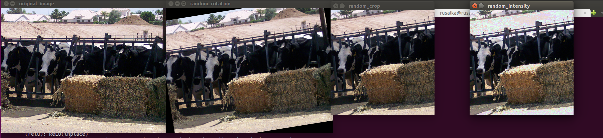

# Introduction
The project aims to train a neural network to learn
to classify images by only providing a folder structure of images. It supports both Linux and MacOS and also both CPU and GPU.

# Set up environment
The project uses `andaconda` to set up the python environment and `pytorch` as
machine learning framework.
First step is to [install anaconda](https://conda.io/miniconda.html). Keep in mind
that the first time you install anaconda you will have to either activate it
or restart your compuer. In linux this means you'll need to run `source .bashrc`
Once it's installed, run `./bin/setup.sh` that will install the python3.6 environment
together with all the necessary dependencies.
The environment name is called `pytorch`, and you can enable it by using `source activate pytorch`.
Keep in mind, if the `pytorch` anaconda environment is not enabled, it'll fail to work.

# Creating the dataset
Before training you'll need to have a set of images which you will need to
store in a directory using the following structure:`<CLASS_LABEL>/<IMAGE_NAME>`

For example, if you have a dataset of images of trees and plants, your final
dataset shall look like:
```
/home/audrey_hepburn/images/tree/wild_tree.jpg
/home/audrey_hepburn/images/tree/pine_32835.jpg
/home/audrey_hepburn/images/tree/alpen_baum.jpg
/home/audrey_hepburn/images/tree/wild_tree.jpg
...
/home/audrey_hepburn/images/plant/A001_orchid.jpg
/home/audrey_hepburn/images/plant/lavander_4323.jpg
/home/audrey_hepburn/images/plant/SAGE_Italy.jpg
/home/audrey_hepburn/images/plant/photo_dill.jpg
...
```

The next step is creating the actual dataset splitting the images into train and
test.
For that you'll need to run:

`python image_classifier/DatasetBuilder.py --images_folder=/home/audrey_hepburn/images --dataset_folder=/home/audrey_hepburn/dataset`

In case you have both the `images` and the `dataset` folder in the project itself (e.g. `/home/audrey_hepburn/image_classifier/images`)
then it's enough using:

`python image_classifier/DatasetBuilder.py`.

You can also set the percentage of the test set by using the option `--test_percentage`. By default it's 10%. Check `--help` option for a full description of the available options:
```
Usage: DatasetBuilder.py [OPTIONS]

Options:
  --images_folder TEXT     Images folder
  --test_percentage FLOAT  Percentage of test set between 0 and 100
  --dataset_folder TEXT    Folder where dataset is stored
  --help                   Show this message and exit.
```

After running the command you should get in the `dataset` folder something similar to:
```
dataset/
├── tree_test.json
├── tree_train.json
├── plant_test.json
├── plant_train.json
└── labels.json
```

These files contrain the train and test set for all the classes as well as
the order of the class labels in the network output ( `dataset/labels.json` )

# Training The Model
The first time the training starts it's necessary to add the option `--reset_model=true`.
That will automatically download a deep convolutional network (resnet18) trained for resnet, remove the classifier, and add a new classifier for the dataset.
Keep in mind that you decide to change the number of class labels, you'll need to reset
the model again. The model's new classifier is initialized using [xavier initialization](http://pytorch.org/docs/master/_modules/torch/nn/init.html).

`python image_classifier/ClassifierTrainCli.py --reset_model=true`


During the training the log will look like:

```
2018-01-19 18:25:28.557219 -- Epoch [57/10000] -- Iter [101/114] -- Train Loss: 0.000509 -- Train F1-Score in Batch: 1.0 -- Train F1-Score in Epoch: 0.9981
2018-01-19 18:25:28.840080 -- Epoch [57/10000] -- Iter [102/114] -- Train Loss: 0.0003899 -- Train F1-Score in Batch: 1.0 -- Train F1-Score in Epoch: 0.9982
2018-01-19 18:25:29.123776 -- Epoch [57/10000] -- Iter [103/114] -- Train Loss: 0.00332 -- Train F1-Score in Batch: 1.0 -- Train F1-Score in Epoch: 0.9982
2018-01-19 18:25:29.407557 -- Epoch [57/10000] -- Iter [104/114] -- Train Loss: 0.001104 -- Train F1-Score in Batch: 1.0 -- Train F1-Score in Epoch: 0.9982
2018-01-19 18:25:29.691633 -- Epoch [57/10000] -- Iter [105/114] -- Train Loss: 0.131 -- Train F1-Score in Batch: 0.9687 -- Train F1-Score in Epoch: 0.9979
```
The meaning of each of the fields if the following:
 - **Epoch**: iteration over the entire training set
 - **Iteration**: iteration in the epoch (batch)
 - **Train Loss**: corss-entroy loss in the iteration's batch
 - **Train F1-Score in Batch**: [F1-Score](https://en.wikipedia.org/wiki/F1_score) in the batch
 - **Train F1-Score in Epoch**: [F1-Score](https://en.wikipedia.org/wiki/F1_score) in the current epoch (cumulative F1-Score over all the iterations inside the batch)

Each time an epoch finishes the model will be tested, and in case it improves it'll
store the model in the models folder (default `$PWD/models/model_best.model`)
```
2018-01-19 17:45:43.109032 -- Model Improved. Previous Best Test F1-Score 0.9528 | Current Best Test F1-Score  0.9628
2018-01-19 17:45:43.109067 -- ... saving model ...
2018-01-19 17:45:43.175670 -- ... model saved.
2018-01-19 17:45:43.175728 -- Epoch 4
```


In case it does not improve, the model won't be overwritten. Nonetheless,
in any case results will be logged
```
2018-01-19 18:25:33.489587 -- Model did *NOT* Improve. Current Best Test F1-Score 0.9975 | Current Test F1-Score 0.9975
```

See option `--help` for a complete list of training options
```
Usage: ClassifierTrainCli.py [OPTIONS]

Options:
  --model_file TEXT      Path of the filename where the model is saved.
  --images_folder TEXT   Folder where the images are stored. Each subfolder
                         shall contain the class label and each subfolder has
                         to contain all the images
  --dataset_folder TEXT  Folder where dataset is stored
  --visual_logging TEXT  Only Desktop. Display additional logging using images
                         (e.g. image sampling). Do not use it in a server, it
                         requires a desktop environment.
  --reset_model TEXT     Reset model (start model from scratch).
  --num_epochs INTEGER   Number of epochs.
  --batch_size INTEGER   Batch size.
  --learning_rate FLOAT  Learning rate
  --gpu INTEGER          Only used if CUDA is detected. GPU index. Index
                         starts from 0 to N - 1 for N GPUs in your system.
  --help                 Show this message and exit.
```

## Test Sampling

Sampling during test set is deterministic to ensure consistency comparing models.
The only distortion to the image is croping its center removing a 10% from each
side.

## Train Sampling

Sampling during training ensures unifor sampling of each class. On top of that,
there are the following distortions to the image for augmentation:
  - Center crop with randomize X and Y transation from 0% to 10%
  - Angle distorion from -10 degrees to +10 degrees
  - Intensity, from 50% atenuation to 50% amplification

### Visual Loggging

One of the options of the training script is `--visual_logging`, whcih when
enabled allows to visualize the different distortions.

For example:

`python image_classifier/ClassifierTrainCli.py --visual_logging=true`

Which displays:



# Inference

For inference there is a convenient CLI script `image_classifier/ClassifierInferenceCli.py`
that can be run using:

`python image_classifier/ClassifierInferenceCli.py --image_path=<PATH OF THE IMAGE>`

For example:

```
pytorch) audrey_hepburn@audrey_hepburn-:~/image_classifier$ python image_classifier/ClassifierInferenceCli.py --image_path=images/Chickens/2916577134_97269ffab5.jpg
{ 'class_label': 'Chickens', 'probability': 0.9995 }
(pytorch) audrey_hepburn@audrey_hepburn-:~/image_classifier$ python image_classifier/ClassifierInferenceCli.py --image_path=images/Cows/483647887_10e32baf7f.jpg
{ 'class_label': 'Cows', 'probability': 0.9679 }
```

The results are in JSON to ease integration with other projects.

There is also the script `image_classifier/ClassifierInference.py` that can
be used in third party projects to do inference.

For example:
```
  class_labels = ClassLabels(dataset_folder).labels
  model = torch.load(model_file)
  classifier_inference = ClassifierInference(model, class_labels, gpu)
  image = cv2.imread(image_path, cv2.IMREAD_COLOR)
  class_label, probability = classifier_inference.predict(image)
```
